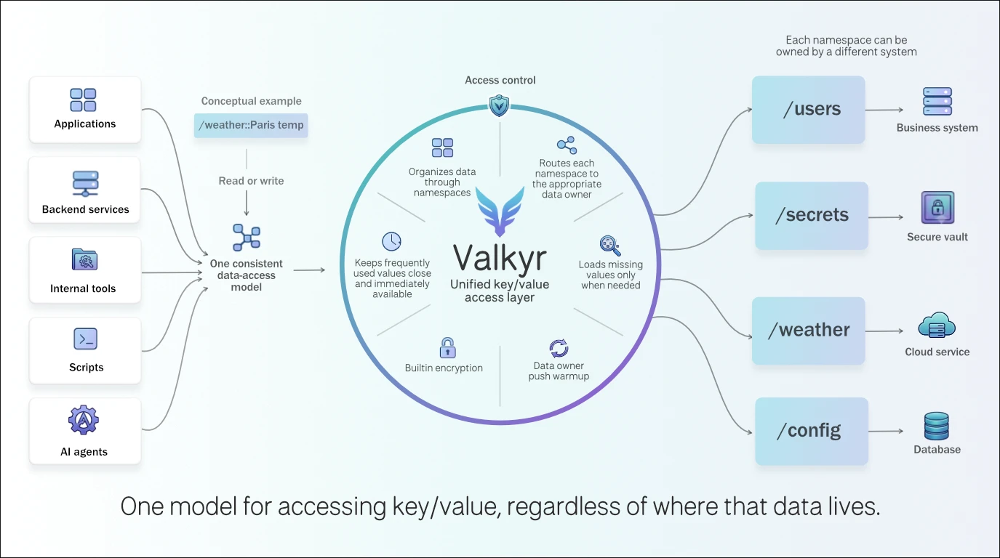

# Valkyr

Valkyr provides a unified key/value interface for accessing and sharing data distributed across different systems. Applications interact with Valkyr through a consistent namespace-and-key model, without needing to know where the data is stored or how each underlying system is accessed.

<div align="center">
  
</div>
Each namespace can be assigned to a backend adapter that defines how Valkyr retrieves and stores its data. For example, one adapter may handle the `users` namespace using a SQL database, while another handles a `secrets` namespace through OpenBao or a remote API. Backend adapters can also proactively push new or updated values to Valkyr, keeping its in-memory data synchronized without waiting for an application request.

Valkyr can keep frequently accessed values in memory and load missing data from the appropriate backend on demand. Access control, expiration, and encryption are built in.

> AI-assisted, human-directed. Valkyr is early-stage software (`0.1.0`). Read the [security guide](docs/security.md).

## Quick start

This tutorial uses the published Docker images or cargo if run with source. The native-process examples use loopback addresses. The Docker
examples use the addresses defined in their Docker-specific configuration
files. The bootstrap key is an administrator credential for local setup; do not
commit it or use it as an application credential.

### 1. Start the server

Start Valkyr. At this point, the server has only its in-memory store.

```sh
cargo run -p valkyr-server -- --config example/valkyr-server-dev.yml
```

Or, with Docker:

```sh
docker run --rm --name valkyr-server -t -v "$PWD/example:/etc/valkyr:ro" \
  -p 8081:8081 -p 8080:8080 -p 8090:8090 \
  docker.io/ckphil/valkyr-server:latest \
  --config /etc/valkyr/valkyr-server-docker.yml
```

Set and get a JSON value through the REST API:

```sh
bootstrap_key="$(cat example/bootstrap-api-key)"

curl --fail-with-body -X PUT -H "Authorization: Bearer $bootstrap_key" \
  --json '{"name":"Alice"}' 'http://127.0.0.1:8080/example?some-key'

curl --fail-with-body -H "Authorization: Bearer $bootstrap_key" \
  'http://127.0.0.1:8080/example?some-key'
```

The value is available now, but it exists only in the server's memory. It is
lost when the server restarts.

### 2. Add a database adapter for durable values

The database adapter can act as both a provider and a store. It answers cache
misses from SQLite, MySQL, or PostgreSQL and persists successful writes before
Valkyr commits them to its in-memory cache.

```sh
mkdir -p example/runtime
cargo run -p valkyr-db-adapter -- --config example/sqlite-config-dev.yml
```

Or, with Docker:

```sh
docker run --rm --name valkyr-db-adapter -t -v "$PWD/example:/etc/valkyr:ro" \
  -v "$PWD/example/runtime:/etc/valkyr/runtime" \
  docker.io/ckphil/valkyr-db-adapter:latest \
  --config /etc/valkyr/sqlite-config-docker.yml
```

This example adapter owns the `/example` namespace as both a provider and a
store. It writes successful changes to SQLite and can load a value after a
cache miss.

Write another value to `/example`:

```sh
curl --fail-with-body -X PUT -H "Authorization: Bearer $bootstrap_key" --json '{"name":"Bob"}' 'http://127.0.0.1:8080/example?durable-key'
```

This write is now durable in `example/runtime/example.db`. If the server loses
its cache, the adapter reloads the value on the next read. That first read can
be a retryable cache miss; repeat the request shortly afterward.

### 3. Add an OpenBao adapter for authentication and encryption

To handle credentials and encryption, Valkyr needs an adapter that owns its
reserved `/__auth` and `/__secrets` namespaces. The OpenBao adapter that comes
with Valkyr can be configured to handle both.

Start a disposable local OpenBao instance and create its AppRole credentials:

```sh
OPENBAO_RUNTIME=docker ./example/setup-openbao.sh
cargo run -p valkyr-openbao-adapter -- --config example/openbao-security-config-localhost.yml
```

`/__auth` holds API-key records. Valkyr looks up an application's identity and
permissions there. The bootstrap key can create these records; the
OpenBao adapter keeps them durable and makes them available to the server.

Create an application key that is limited to `/example`, then use it instead
of the bootstrap key. This key can read and write both normal and encrypted
values in that namespace:

```sh
curl --fail-with-body -X PUT -H "Authorization: Bearer $bootstrap_key" \
  --json '{
    "client_id": "example-app",
    "name": "Example application",
    "permissions": [
      {
        "namespace": "/example",
        "operations": ["read", "write", "read_encrypted", "write_encrypted"]
      }
    ]
  }' http://127.0.0.1:8080/__auth?example_api_key

curl --fail-with-body -X PUT -H "Authorization: Bearer example_api_key" \
  --json '{"name":"Charlie"}' 'http://127.0.0.1:8080/example?using-api-key'

curl --fail-with-body -H "Authorization: Bearer example_api_key" \
  'http://127.0.0.1:8080/example?using-api-key'
```

The first request with a new application key can briefly return a retryable
authentication-pending response while Valkyr loads the record; repeat it if
that happens.

`/__secrets` holds the encryption keys used for values whose key is wrapped in
`~`, such as `~token~`. The adapter creates a namespace key on first use and
stores it in the adapter that owns `/__secrets`, so encrypted values remain
readable after a restart as long as that adapter data is retained. For example:

```sh
curl --fail-with-body -X PUT -H "Authorization: Bearer example_api_key" \
  --json '"keep this private"' http://127.0.0.1:8080/example?~token~
```

The stored value can be retrieved and decrypted on the fly.

```sh
curl --fail-with-body -H "Authorization: Bearer example_api_key" \
  'http://127.0.0.1:8080/example?~token~'
```

Querying without the `~` returns an encrypted object:

```sh
curl --fail-with-body -H "Authorization: Bearer example_api_key" \
  'http://127.0.0.1:8080/example?token'
```

### 4. Write a custom adapter

Custom adapters can provide values, persist values, or do both. A provider
answers cache-miss requests or publishes values proactively; a store receives
mutations and confirms them before Valkyr updates its cache. Build custom
adapters with the [Rust client library](valkyr-client/README.md), [Python
SDK](valkyr-python/README.md), or [Go SDK](valkyr-go/README.md).

For example, start the Python temperature adapter service:

```sh
VALKYR_API_KEY=$bootstrap_key PYTHONPATH="./valkyr-python/src" python3 example/open_meteo_temperature_adapter.py
```

```sh
curl --fail-with-body \
  -H "Authorization: Bearer $bootstrap_key" \
  'http://127.0.0.1:8080/weather/loc::48.8566,2.3522?temperature'
```

## Adapters

Adapters connect Valkyr namespaces to external data systems. Each adapter can
register one or more providers, stores, or both:

| Adapter | Status | Role | Documentation |
| --- | --- | --- | --- |
| Database | Available | SQLite, MySQL, and PostgreSQL providers and durable stores | [`valkyr-db-adapter/README.md`](valkyr-db-adapter/README.md) |
| OpenBao | Available | OpenBao KV v2 providers and stores, including `/__auth` and `/__secrets` | [`valkyr-openbao-adapter/README.md`](valkyr-openbao-adapter/README.md) |
| S3 | Planned | — | — |

For a provider that only warms data, use a `PROVIDE` registration. For durable
write-through persistence, use a `STORE` registration. See the [protocol
guide](docs/commands.md) for registration and callback details.

## Python SDK

A first-party Python SDK lives in `valkyr-python/` and is published to PyPI as
`valkyr`. It requires Python 3.11+ and is independent of the Rust Cargo workspace.

```sh
pip install valkyr
```

```python
from valkyr import Client, Miss, Value

async with Client.connect("127.0.0.1:8081", api_key="app-key") as client:
    user = client.namespace("/users").key("42")
    await user.set({"name": "Ada"}, ttl_seconds=300)
    result = await user.get_with_retry()
    if isinstance(result, Value):
        print(result.value)
    elif isinstance(result, Miss):
        print(f"provider warming: retry after {result.retry_after_ms}ms")
    else:
        print("value is absent")
```

See [`valkyr-python/README.md`](valkyr-python/README.md) for provider/store
adapter examples, TLS options, and integration-test instructions.

## Go SDK

The standalone Go SDK lives in `valkyr-go/` and targets Go 1.25, Valkyr server
`0.1.x`, and native protocol v1. Install it from a repository subdirectory tag:

```sh
go get github.com/ckphil/valkyr/valkyr-go@v0.1.0
```

```go
client, err := valkyr.Dial(ctx, "127.0.0.1:8081", valkyr.WithAPIKey("app-key"))
if err != nil {
    return err
}
defer client.Close()

result, err := client.Namespace("/users").Key("42").GetWithRetry(ctx)
if err != nil {
    return err
}
switch result := result.(type) {
case valkyr.Value:
    var user User
    _ = result.Decode(&user)
case valkyr.Miss:
    fmt.Printf("provider warming: %s\n", result.RetryAfter)
case valkyr.Unknown:
    fmt.Println("value is absent")
}
```

The same package exposes `NewAdapter` and `NewAdapterClient` for bounded,
reconnecting provider/store callbacks. See [`valkyr-go/README.md`](valkyr-go/README.md)
for TLS configuration, result/error handling, examples, integration checks,
and the `valkyr-go/v<version>` release-tag convention.

## REST API

Every REST request uses `Authorization: Bearer <api-key>`. The path is the
absolute namespace and the raw query string is one key—not a `name=value`
parameter. Percent-encode reserved characters in namespaces and keys.

A namespace may optionally select a context with `::<context>`: `/users` is
the root namespace, while `/users::acme` addresses users for the Acme tenant.
Use the same key query format for either form, for example `/users::acme?42`.

### Get a value

`GET /<namespace>[::<context>]?<key>` returns the JSON value, or `404` when it
is absent.

```sh
curl --fail-with-body \
  -H "Authorization: Bearer $bootstrap_key" \
  'http://127.0.0.1:8080/example?name'
```

### Set or replace a value

`PUT /<namespace>[::<context>]?<key>` accepts a JSON body and returns
`204 No Content`. Set an optional positive TTL in seconds with `Valkyr-Ttl`.

```sh
curl --fail-with-body -X PUT \
  -H "Authorization: Bearer $bootstrap_key" \
  -H 'Content-Type: application/json' \
  -H 'Valkyr-Ttl: 300' \
  --data '{"name":"Ada","role":"admin"}' \
  'http://127.0.0.1:8080/users::acme?42'
```

### Delete a key or namespace

`DELETE /<namespace>[::<context>]?<key>` deletes one exact key. Omitting the
query string requests deletion of the whole namespace or context. Both forms
return `204 No Content` when authorized; a configured storage adapter may
reject namespace deletion.

```sh
# Delete the key "42" from /users.
curl --fail-with-body -X DELETE \
  -H "Authorization: Bearer $bootstrap_key" \
  'http://127.0.0.1:8080/users?42'

# Delete every value in /users.
curl --fail-with-body -X DELETE \
  -H "Authorization: Bearer $bootstrap_key" \
  'http://127.0.0.1:8080/users'
```

### Move a context

`PUT /<namespace>::<context>` with a `Destination` header renames a context
within the same base namespace. It accepts neither a key query nor a body and
returns `204 No Content`.

```sh
curl --fail-with-body -X PUT \
  -H "Authorization: Bearer $bootstrap_key" \
  -H 'Destination: /config::production' \
  'http://127.0.0.1:8080/config::staging'
```

For normal use, use the bootstrap key only to create least-privilege `/__auth`
records, then authenticate applications with those keys. A non-bootstrap key
may return a retryable pending response on its first use while Valkyr loads it
from an authentication provider. See [security](docs/security.md) and the
[server guide](valkyr-server/README.md).

## Rust client

Use the Rust client from an application:

```rust
use valkyr_client::Client;
use valkyr_core::{Key, Namespace};
use serde_json::json;

# async fn example() -> Result<(), Box<dyn std::error::Error>> {
let client = Client::connect("127.0.0.1:8081").await?;
client.authenticate("<bootstrap-or-provisioned-api-key>", None).await?;
client.set(Namespace::new("/users")?, Key::new("42")?, json!({"name": "Ada"}), None).await?;
assert_eq!(client.get(Namespace::new("/users")?, Key::new("42")?).await?, json!({"name": "Ada"}));
# Ok(())
# }
```

## Testing

Run all Rust workspace checks with `cargo test --workspace`.

For a local Docker setup with OpenBao and both adapters, see
the configuration files in [`example/`](example/).

## Documentation

- [Architecture and protocol](docs/commands.md)
- [Security model](docs/security.md)
- [Security reporting](SECURITY.md)

## License

Licensed under the [Apache License 2.0](LICENSE).
